# Tac_portal 

Two tier application which provides a dedicated functionality and features to each users
1. Users [Students, admins];
2. Server with database
   
## Scope:
1. This software system will serve as a portal for the Technical Approval Committee (TAC), enabling students to submit their projects and receive their rewards. From an administrative perspective, this system will provide a comprehensive analytical dashboard for project oversight.
2. Administrators have the ability to approve or reject projects. Once a project is approved, students can schedule an appointment using their accepted PTAC ID. The system will calculate the number of days between the approval date and the current date. If this duration is less than 30 days, a warning will be displayed indicating that students can claim only 30% of their rewards, which is contingent on the number of days since approval.
   
## Features:
1. Login and registration
2. TAC Application Submission
3. Application Status(tracking)
4. Appointment Booking
5. Admin Access
6. Admin’s Analytical Dashboard

## overview of the project 
### user's view
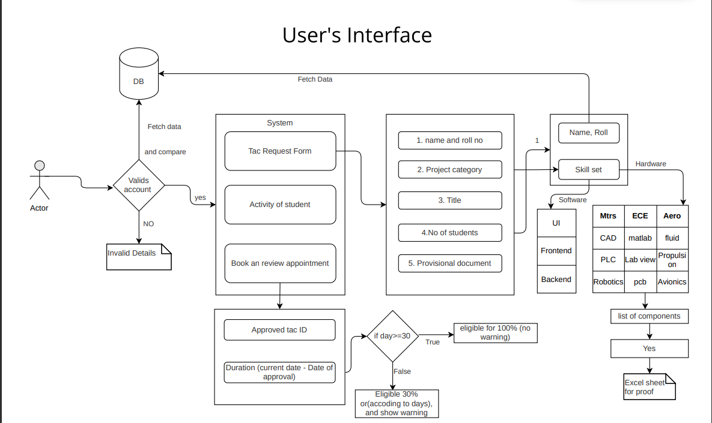
### admin's view
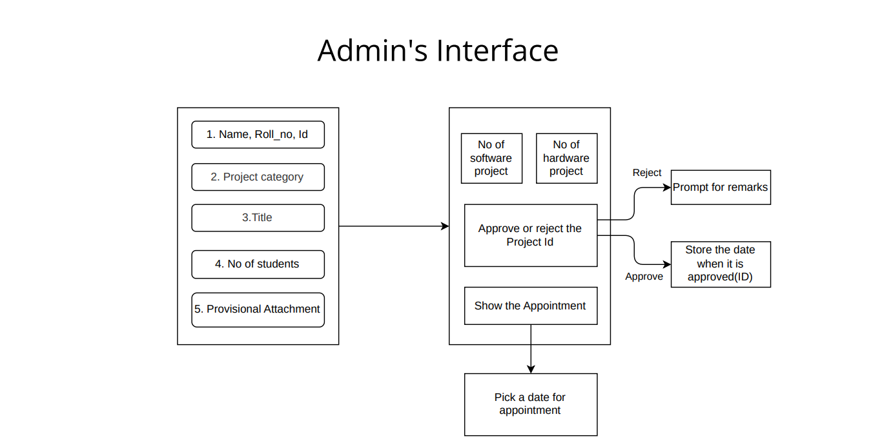

## Prototype:
### Login:
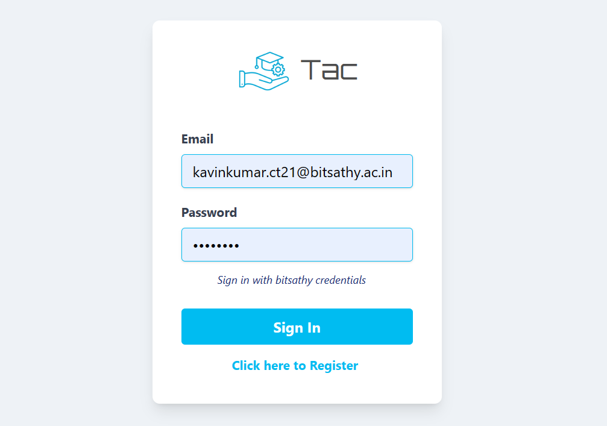

### Register:
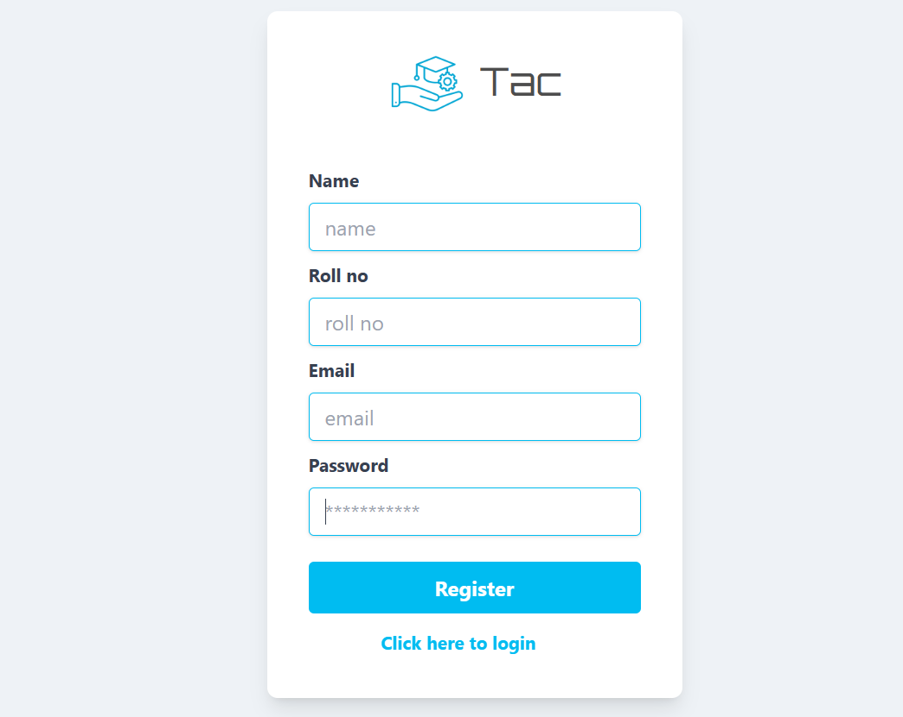


### Studnet's Home:
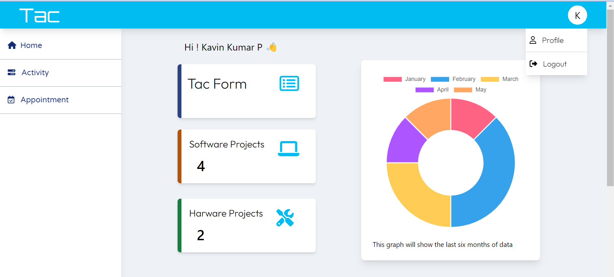

### Tac form:
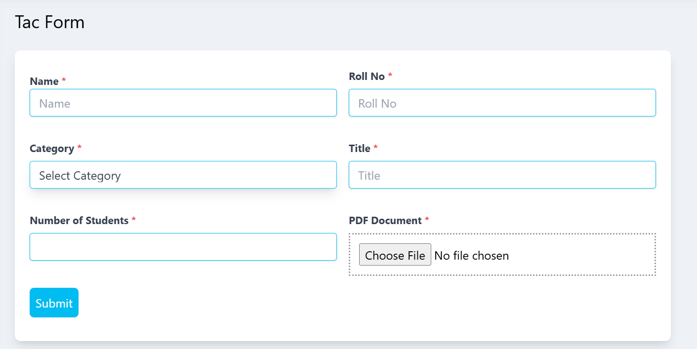

### Appointment booking form:
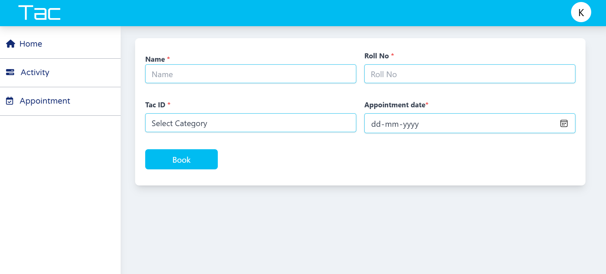

### Student's Activity:
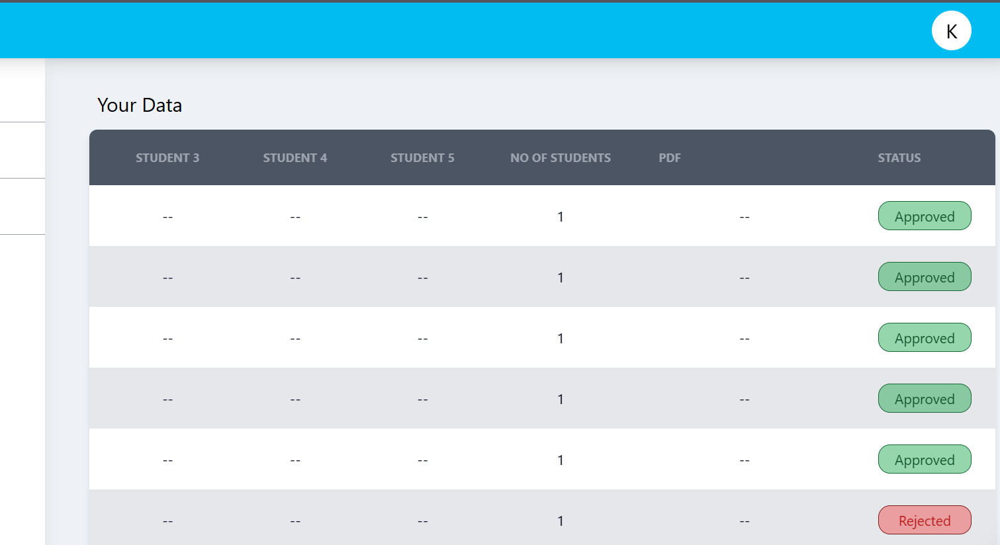

### admin's Home:
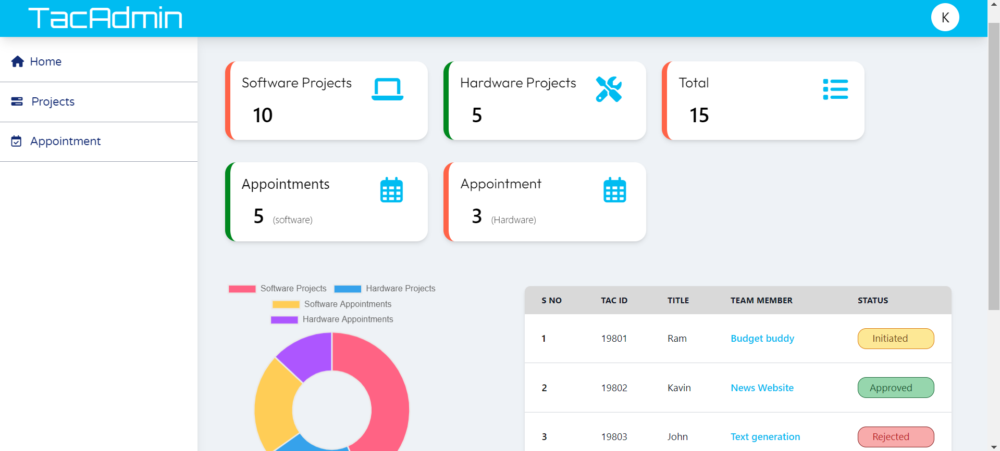

### admin's Activity:
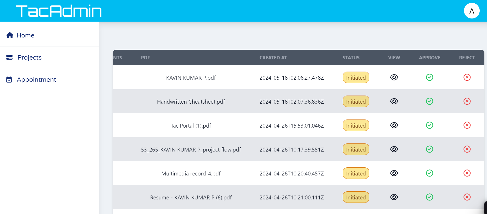

### admin's Detailed view of each entry:
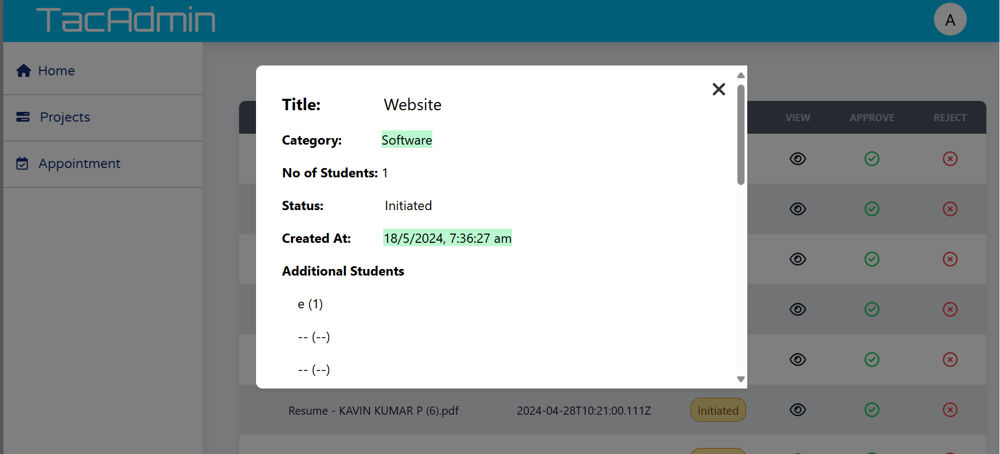


## Project setup to install the dependencies
```
npm install
```

### Compiles and hot-reloads for development
```
npm run serve
```

### Compiles and minifies for production
```
npm run build
```

### Lints and fixes files
```
npm run lint
```

### Customize configuration
See [Configuration Reference](https://cli.vuejs.org/config/).
